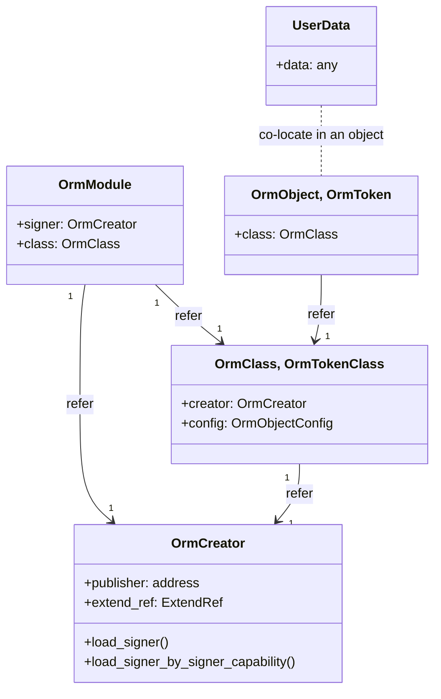
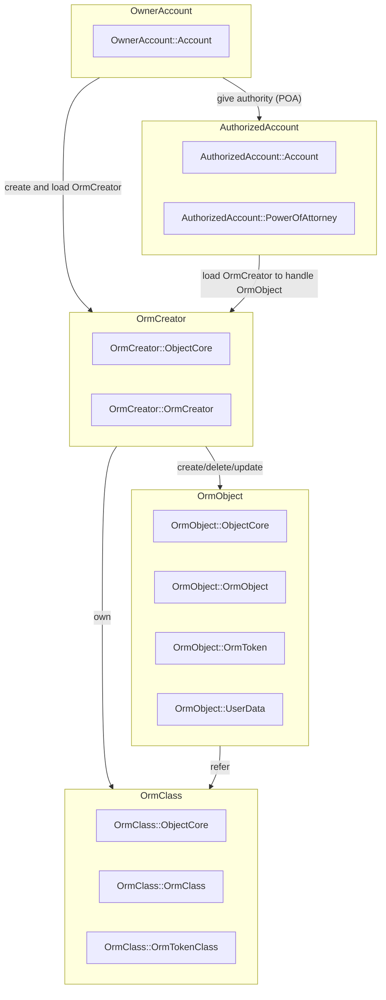

# AptoORM

**AptoORM** is a utility for Object–relational mapping from Typescript and Javascript class objects to Aptos Object model.

Once you define a class in your source code with AptoORM decorators, you can record the class objects to Aptos Blockchain. It is also supported to update, delete them on chain and to transfer the ownership of the objects to others as like other digital assets.

Furthermore, `AptoORM` can be a framework to create, mint NFT on Aptos Blockchain with simple and clear settings.

## Features

- [x] Add `OrmObject` to `OrmClass` decorator.
- [x] Add `OrmToken` to `OrmTokenClass` decorator.
- [x] Add ORM Token generation to `gen-move.ts`.
- [x] Remove `OrmToken`'s name, description and uri from user data.
- [x] Add OrmToken's name, description and uri fields update procedure with `token_mutable_by_creator` and `token_mutable_by_owner` options.
- [x] Rename `OrmCollection` to `OrmTokenClass`.
- [x] Add update and delete operations for `OrmToken`.
- [x] Add an option, `immutable`, for the `name`, `uri` and `description` fields of `OrmToken`.
- [x] Updated `get` function generated by user-defined class.
- [x] Add Aptos Collection object name option to `OrmTokenConfig`.
- [x] Add `constant` option to `OrmTokenConfig` for fixed `name`, `uri` and `description` fields of `OrmToken`. The OrmToken has the same name, uri and descriptions if it is configured.
- [x] Add `index_fields` option to `OrmClass` and `OrmField` in order to Aptos create named object.
- [x] Add `package` configuration
- [x] Add default `royalty_payee` to class object.
- [x] Add `OrmFreePrepayClient`, `OrmFreePostpayClient` for free transaction fee interface.
- [x] Add `PoA` typescript API
- [x] Add `create_to` (create and send an object) API
- [ ] Add `royalty_present_per_token` to represent the royalty to each token.
- [ ] Add `UpdateDateField()`, `CreateDateField()`.
- [x] Add new `OrmField` option (`token_property`) to add/delete the field from/to token's property_map.
- [ ] Add txn result parser to get the object or token created.
- [ ] Add Indexer function to list the created objects.
- [ ] Check need to add the move ability [key, store, drop, copy] should be controlled by the AptoORM.
- [x] Add CLIs for example.

## Installation

Install the npm package:

```shell
npm install apto_orm --save
```

You need to install reflect-metadata:

```shell
npm install reflect-metadata --save
```

and import it somewhere in the global place of your app (for example in app.ts):

```typescript
import "reflect-metadata"
```

You may need to install node typings:

```shell
npm install @types/node ts-node --save-dev
```

> `ts-node` is required to execute the `apto_orm cli`.

### TypeScript configuration

Also, make sure you are using TypeScript version 4.5 or higher, and you have enabled the following settings in tsconfig.json:

```json
"emitDecoratorMetadata": true,
"experimentalDecorators": true,
```

## Getting Started

You can start a project with `apto_orm` from scratch. Try the following.

### Initialize your package

```bash
# package.json
pnpm init

# add build command to package.json
jq --arg key "build" --arg val "tsc --build" '.scripts[$key]=$val' package.json | jq "." > _package.json && mv _package.json package.json

# add `apto_orm` command to package.json
jq --arg key "orm" --arg val "apto_orm" '.scripts[$key]=$val' package.json | jq "." > _package.json && mv _package.json package.json

# setup tsconfig
{
  echo "{"
  echo '  "compilerOptions": {'
  echo '    "target": "ES2020",'
  echo '    "module": "CommonJS",'
  echo '    "moduleResolution": "node",'
  echo '    "skipLibCheck": true,'
  echo '    "resolveJsonModule": true,'
  echo '    "esModuleInterop": true,'
  echo '    "emitDecoratorMetadata": true,'
  echo '    "experimentalDecorators": true,'
  echo '    "allowSyntheticDefaultImports": true,'
  echo '    "declaration": false,'
  echo '    "outDir": "dist"'
  echo '  },'
  echo '  "include": ["src"],'
  echo '  "exclude": ["node_modules", "**/*.spec.ts"]'
  echo "}"
} > tsconfig.json

# setup .gitignore.
{
  echo 'dist'
  echo 'out'
  echo 'build'
  echo 'node_modules'
  echo '**/build'
  echo '.key'
} > .gitignore
```

### Initialize package account

```bash
# Create a keypair to .key directory
mkdir -p .key
aptos key generate --assume-yes --output-file .key/supervlabs

# Initialize Aptos account and receive funds of Aptos Coin if devnet or testnet because your package publishing costs Aptos Coin.
aptos init --network devnet --private-key-file .key/supervlabs --profile supervlabs
```

### Create and modify your class.

Create your sample typescript class by `apto_orm` `init` command.
This command will create a class file (`MyToken.ts`) to `src/my_tokens`.

```bash
npx apto_orm init src/my_tokens --key .key/supervlabs --token -c MyToken
```

Modify the following token class to suit your taste.

```typescript
import { OrmTokenClass, OrmField, OrmIndexField } from 'apto_orm';

@OrmTokenClass({
  package_address: '0x43ded2bab6265e70d3fe47879e2af7d7826984c1f44e5fe6cb4912678c3cab40',
  package_creator: '0x8953be30cc7c69682a2aa972fefee8d8ba474eb69830349d03cda73f5568e8ff',
  package_name: 'my_tokens',
  collection_name: 'AptoORM MyToken',
  collection_uri: 'https://raw.githubusercontent.com/neoul/apto_orm/main/resource.png',
  collection_description: 'Sample AptoORM Token',
  max_supply: 1000n,
  token_use_property_map: false,
  royalty_present: false,
  royalty_denominator: 100,
  royalty_numerator: 1,
})
export class MyToken {
  @OrmIndexField({ immutable: true })
  id!: number;

  @OrmField({ immutable: true })
  name!: string;

  @OrmField()
  uri!: string;

  @OrmField()
  description!: string;
}
```

### Generate your Move module and publish it to onchain

The following command generates a Move module based on your class to
`YOUR_PACKAGE_PATH/move`.

```bash
npx apto_orm generate src/my_tokens
# classes 'MyToken' are created to the package 'my_tokens'
#  - creator: 0x8953be30cc7c69682a2aa972fefee8d8ba474eb69830349d03cda73f5568e8ff
#  - address: 0x43ded2bab6265e70d3fe47879e2af7d7826984c1f44e5fe6cb4912678c3cab40
#  - path: /home/willing/projects/apto_example/src/my_tokens
```

The generated module must be compiled and published to your package account. This package account is an object that has the signer capability of your package and is a place where your package bytecodes are stored.

```bash
npx apto_orm compile src/my_tokens
npx apto_orm publish src/my_tokens --key .key/supervlabs
```

> Please check for information about [Aptos Move language](https://aptos.dev/move/move-on-aptos).

### create, update and delete your apto_orm objects by apto_orm cli

```bash
npx apto_orm create src/my_tokens --key .key/supervlabs -c MyToken -d '{ "uri": "https://raw.githubusercontent.com/neoul/apto_orm/main/resource.png", "description": "ok", "id": 1, "name": "ABC" }'
npx apto_orm create src/my_tokens --key .key/supervlabs --to 0xfd2984f201abdbf30ccd0ec5c2f2357789222c0bbd3c68999acfebe188fdc09d -c MyToken -d '{ "uri": "https://raw.githubusercontent.com/neoul/apto_orm/main/resource.png", "description": "ok", "id": 2, "name": "EFG" }'
npx apto_orm delete src/my_tokens --key .key/supervlabs -c MyToken -a 0x10dd8012f4c83a2e058347d7178d81432fcadf30cc11e623e2c8ba93a0a786df
```

## POA (Power Of Attorney)

POA Account is an account that can generate and transfer the transaction. The account has the POA (Power of attorney) creates AptoORM Objects instead of the NFT Creator.

### Initialize POA

```bash
aptos key generate --assume-yes --output-file .key/poa1
aptos init --network devnet --private-key-file .key/poa1 --profile poa1
npx apto_orm poa register -d .key/supervlabs -l .key/poa1
npx apto_orm poa show -l .key/poa1
```

### Mint a token by POA

```bash
npx apto_orm create src/my_tokens --key .key/poa1 -c MyToken \
 -d '{ "uri": "https://raw.githubusercontent.com/neoul/apto_orm/main/resource.png", "description": "ok", "id": 100, "name": "ABC" }'
```

## Build AptoORM on your local machine

### Test, Build and publish AptoORM to your local onchain (local machine)

```sh
# [How to build, test and run]
# testing
docker build --target apto_orm-testing -t apto_orm-testing .

# Building
docker build -t apto_orm .

# Running
docker run -d -p 8080-8082:8080-8082 -p 9101:9101 -p 50051:50051 -p 5678:5678 --name apto_orm apto_orm

# Downloading keys and .env
curl http://localhost:8082/download.sh | sh
```

Or you can setup AptoORM at once.

```bash
./run.sh setup
```

## ORM Onchain Architecture

### ORM modules

#### orm_creator

`orm_creator` module provides a signer object that becomes the creator of AptoORM class objects in order to support the programmatic onchain resource handling. The signer object that has `OrmCreator` resource returns back its signer if the transaction sender (signer) is the owner of the signer object. It also returns the signer if other accounts authorized by the owner through `PowerOfAttorney` resource declaration. The owner account can register or revoke the authorized accounts directly or via the proof challenge.

#### orm_class

`orm_class` module is used to store the onchain properties of the user-defined class.

#### orm_module

`orm_module` is used to designate the `orm_creator` and `orm_class` of your class module.
The `orm_module` is recorded to your account that is a placeholder to deploy your class module.

#### orm_object

`orm_object` ... TBD

### ORM Onchain Resource



### Onchain accounts in ORM Onchain Architecture



## AptoORM Free Charge server

[설명 추가]