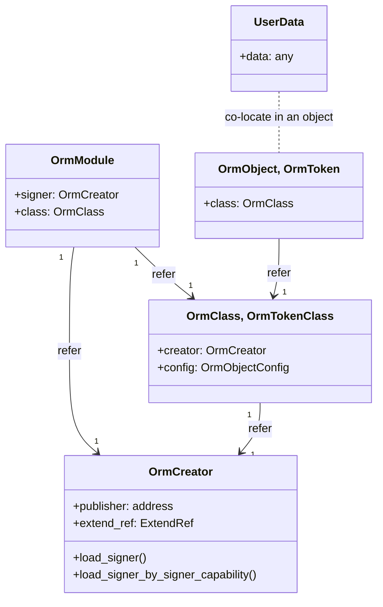
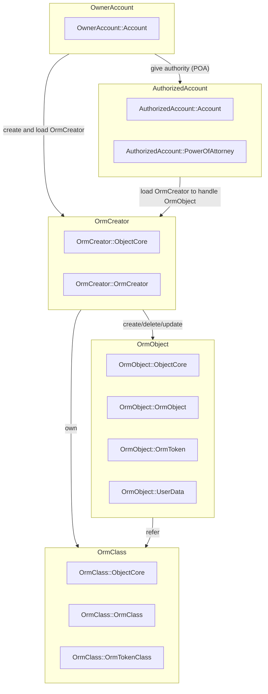

# AptoORM

**AptoORM** is a utility for Object–relational mapping from Typescript and Javascript class objects to Aptos Object model.

Once you define a class in your source code with AptoORM decorators, you can record the class objects to Aptos Blockchain. It is also supported to update, delete them on chain and to transfer the ownership of the objects to others as like other digital assets.

Furthermore, `AptoORM` can be a framework to create, mint NFT on Aptos Blockchain with simple and clear settings.

## Build AptoORM and run it on your local machine

### 1. Test, Build and publish AptoORM to your local onchain (local machine)

```sh
# [How to build, test and run]
# testing
docker build --target apto_orm-testing -t apto_orm-testing .

# Building
docker build -t apto_orm .

# Running
docker run -d -p 8080-8082:8080-8082 -p 9101:9101 -p 50051:50051 -p 5678:5678 --name apto_orm apto_orm

# Downloading keys and .env
curl http://localhost:8082/download.sh | sh
```

Or you can setup AptoORM at once.

```bash
./run.sh setup
```

### 2. Once it is published, make your AptoORM class

```typescript
@OrmTokenClass({
  name: 'AptoORM Membership',
  uri: 'https://example.com',
  description: 'Membership token for AptoORM users',
  max_supply: 1000n,
  royalty_present: true,
  royalty_payee: '0x1',
  royalty_denominator: 100,
  royalty_numerator: 10,
})
export class Membership {
  @OrmField({ immutable: true })
  name!: string;

  @OrmField()
  uri!: string;

  @OrmField()
  description!: string;
}
```

### 3. Publish your AptoORM class to onchain

```bash
# [FIXME] AptoORM CLI must be implemented!
# ...
```

### 4. Create instances of your class and record it to onchain

```bash
# [FIXME] AptoORM CLI must be implemented!
# ...
```

## ORM Onchain Architecture

### ORM modules

#### orm_creator

`orm_creator` module provides a signer object that becomes the creator of AptoORM class objects in order to support the programmatic onchain resource handling. The signer object that has `OrmCreator` resource returns back its signer if the transaction sender (signer) is the owner of the signer object. It also returns the signer if other accounts authorized by the owner through `PowerOfAttorney` resource declaration. The owner account can register or revoke the authorized accounts directly or via the proof challenge.

#### orm_class

`orm_class` module is used to store the onchain properties of the user-defined class.

#### orm_module

`orm_module` is used to designate the `orm_creator` and `orm_class` of your class module.
The `orm_module` is recorded to your account that is a placeholder to deploy your class module.

#### orm_object

`orm_object` ... TBD

### ORM Onchain Resource



### Onchain accounts in ORM Onchain Architecture



## AptoORM offchain architecture

## TODO

- [x] Add `OrmObject` to `OrmClass` decorator.
- [x] Add `OrmToken` to `OrmTokenClass` decorator.
- [x] Add ORM Token generation to `gen-move.ts`.
- [x] Remove `OrmToken`'s name, description and uri from user data.
- [x] Add OrmToken's name, description and uri fields update procedure with `token_mutable_by_creator` and `token_mutable_by_owner` options.
- [x] Rename `OrmCollection` to `OrmTokenClass`.
- [x] Add update and delete operations for `OrmToken`.
- [x] Add an option, `immutable`, for the `name`, `uri` and `description` fields of `OrmToken`.
- [x] Updated `get` function generated by user-defined class.
- [x] Add Aptos Collection object name option to `OrmTokenConfig`.
- [x] Add `constant` option to `OrmTokenConfig` for fixed `name`, `uri` and `description` fields of `OrmToken`. The OrmToken has the same name, uri and descriptions if it is configured.
- [x] Add `index_fields` option to `OrmClass` and `OrmField` in order to Aptos create named object.
- [x] Add `package` configuration
- [x] Add default `royalty_payee` to class object.
- [x] Add `OrmFreePrepayClient`, `OrmFreePostpayClient` for free transaction fee interface.
- [x] Add `PoA` typescript API
- [x] Add `create_to` (create and send an object) API
- [ ] Remove event and update `retrieveObjects`
- [ ] Add AptoORM CLI for UX of the AptoORM.
- [ ] Add `royalty_present_per_token` to represent the royalty to each token.
- [ ] Add `UpdateDateField()`, `CreateDateField()`.
- [ ] Add new `OrmField` option (`token_property`) to add/delete the field from/to token's property_map.
- [ ] Add txn result parser to get the object or token created.
- [ ] Add Indexer function to list the created objects.
- [ ] Check need to add the move ability [key, store, drop, copy] should be controlled by the AptoORM.
- [ ] Add CLIs for example.

## AptoORM Free Charge server

```bash
# create_account
curl --request POST http://localhost:5678/fee_free/create_account/8cc3ab2365584ab56b19c52d83069927271175f4711e9058ba7d2de19d31076f

# pay_fee
curl --request POST http://localhost:5678/pay_fee -H "Content-Type: application/json" --data '{ "sender": { "address": "0x1234" }, "payload" : { "function" : "0x1234
::func::call" }}'

npx ts-node src/cli/index.ts init -k ../.key/user my_package
npx ts-node src/cli/index.ts compile my_package
```

## AptoORM Setting Scenario

- [Creating A Typescript Project](https://dev.to/theoparis/creating-a-typescript-project-47gl)
- pnpm add -D apto_orm
- npx apto_orm create simple_token --token
- npx apto_orm compile simple_token
- npx apto_orm publish simple_token --free-charge
- npx apto_orm create/delete/update simple_token --json '{ "abc": .. }'
- npx ts-node ./src/cli/index.ts init simple_token -k ../.key/user --token
- npx ts-node ./src/cli/index.ts compile simple_token
- npx ts-node ./src/cli/index.ts publish simple_token -k ../.key/user
- npx apto_orm create src/inventory -c BaseObject -k ../apto_orm/.key/user -d '{ "id": 1004, "name": "willing" }'